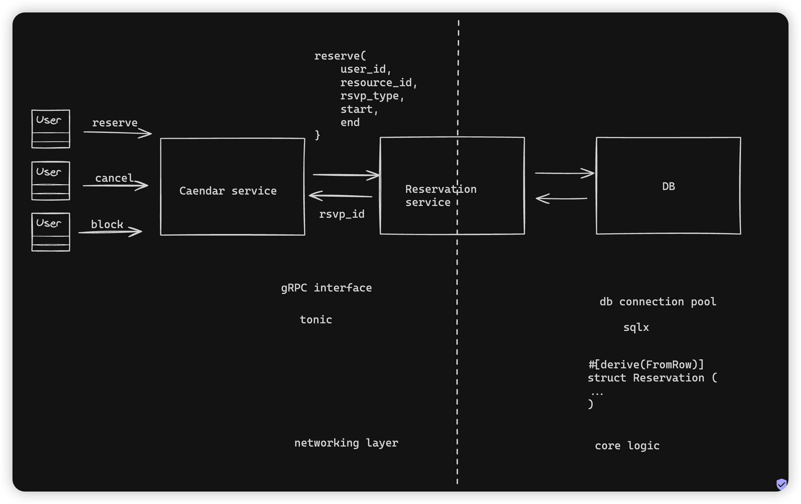

# Core Reservation Service

- Feature Name: core-reservation
- Start Date: 2023-12-23 00:00:08
- RFC PR: [rust-lang/rfcs#0000](https://github.com/rust-lang/rfcs/pull/0000)
- Rust Issue: [rust-lang/rust#0000](https://github.com/rust-lang/rust/issues/0000)

## Summary

A core reservation service that solves the problem of reserving a resource for a period of time. We leverage postgres EXCLUDE constraints to ensure that only one reservation can be made tor a given resource at a gaven time .

## Motivation

We need a common solution for various reservation requirements: 1) calendar booking: 2) hotel/room booking; 3)meeting room booking: 4) parking lot booking: 5) etc. Repeatedly building features for these requirements is a waste of time and resources. We should have a common solution that can be used by all teams .

## Guide-level explanation

Basic architecture:



### Service interface

We would use gRPC as a service interface. Below is the proto definition:

```proto
enum ReservationStatus {
    UNKNOWN = 0;  // 未知
    PENDING = 1;  // 等待中
    CONFIRMED = 2; // 已确认
    BLOCKED = 3;  // 已拒绝
}

enum ReservationUpdateType {
    UNKNOWN = 0;
    PENDING = 1;
    CONFIRMED = 2;
    BLOCKED = 3;
}

message Reservation {
    string id = 1;
    string user_id = 2;
    ReservationStatus status = 3;

    // resource reservation window
    string resource_id = 4;
    google.protobuf.Timestamp start = 5;
    google.protobuf.Timestamp end = 6;

    // extra note
    string note = 7;
}

message ReserveRequest {
    Reservation reservation = 1;
}

message ReserveResponse {
    Reservation reservation = 1;
}

message UpdateRequest {
    ReservationStatus status = 1;
    string note = 2;
}

message UpdateResponse {
    Reservation reservation = 1;
}

message ConfirmRequest {
    string id = 1;
}

message ConfirmResponse {
    Reservation reservation = 1;
}

message CancelRequest {
    string id = 1;
}

message CancelResponse {
    Reservation reservation = 1;
}

message GetRequest {
    string id = 1;
}

message GetResponse {
    Reservation reservation = 1;
}

message QueryRequest {
    string resource_id = 1;
    string user_id = 2;
    // use status to filter result. IF UNKNOWN, return all reservations
    ReservationStatus status = 3;
    google.protobuf.Timestamp start = 3;
    google.protobuf.Timestamp end = 4;
}

message ListenRequest {}

service ReservationService {
    rpc reserve(ReserveRequest) returns (ReserveResponse); // 订阅(insert)
    rpc confirm(ConfirmRequest) returns (ConfirmResponse);
    rpc update(UpdateRequest) returns (Reservation); // 设置 notes
    rpc cancel(CancelRequest) returns (CancelResponse);
    rpc get(getRequest) returns (getResponse);
    rpc query(Reservation) returns (stream Reservation);
    // another system could monitor newly added/confirmed/canceled reservations
    rpc listen(ListenRequest) returns (stream Reservation);
}
```

### Database schema

We use postgres as the database. Below is the schema:

```sql
CREATE SCHEMA rsvp;
CREATE TYPE rsvp.reservation_status AS ENUM ('unknown', 'pending', 'confirmed', 'blocked');
CREATE TYPE rsvp.reservation_update_type AS ENUM ('unknown', 'create', 'update', 'delete');
CREATE TABLE rsvp.reservations (
    id UUID NOT NULL DEFAULT uuid_generate_v4(),
    user_id TEXT NOT NULL,
    status reservation_status NOT NULL DEFAULT 'pending', -- 自定义类型
    resource_id TEXT NOT NULL, -- 外部系统传入, 无需 uuid, 无需 FOREIGN KEY CONSTRAINT
    timespan TSTZRANGE NOT NULL, -- 用区间描述
    note TEXT,
    CONSTRAINT reservations_pkey PRIMARY KEY(id),
    CONSTRAINT reservations_conflict EXCLUDE USING GIST (resource_id WITH =, timespan WITH &&) -- EXCLUDE CONSTRAINT, 不能存在 resource_id 相同, 且 timespan 区间有交集的两行
);
CREATE INDEX reservations_resource_id_idx ON rsvp.reservations (resource_id);
CREATE INDEX reservations_user_id_idx ON rsvp.reservations (user_id);

-- if user_id is null, find all reservations within during for the resource
-- if resource_id is null, find all reservations within during for the user
-- if both are null, find all reservations within during
-- if both set, find all reservations within during for the resource and user
-- 这个函数，开发者可以决定放在应用程序层，或放在数据库层，都可以的，主要是看数据库是否容易实现，不必想太多
CREATE OR REPLACE FUNCTION rsvp.query(uid TEXT, rid TEXT, ts: TSTZRANGE) RETURNS TABLE rsvp.reservations AS $$ $$ LANGUAGE plpgsql;

-- 上文 proto 协议里定义的六个接口，目前只有 query() 需要实现一个 plpgsql，其他并没有必要单独实现 plpgsql


-- reservation change queue
CHANGE TABLE rsvp.reservation_changes (
    id SERIAL NOT NULL,
    reservation_id UUID NOT NULL,
    op rsvp.reservation_update_type NOT NULL,
);


-- trigger for add/update/delete a reservation
CREATE OR REPLACE FUNCTION rsvp.reservation_trigger() RETURNS TRIGGER AS $$
BEGIN
IF TG_OP = 'INSERT' THEN
    -- updete reservation_changes
    insert into rsvp.reservation_changes (reservation_id, op) VALUES (NEW.id, 'create');
ELSIF TG_OP = 'UPDATE' THEN
    -- if status changed, update reservation_changes
    IF NEW.status != OLD.status THEN
        insert into rsvp.reservation_changes (reservation_id, op) VALUES (NEW.id, 'update');
    END IF;
ELSIF TG_OP = 'DELETE' THEN
    -- update reservation_changes
    insert into rsvp.reservation_changes (reservation_id, op) VALUES (OLD.id, 'delete');
END IF;
-- notify a channel called reservation_update
NOTIFY reservation_update;
RETURN NULL; -- 因为是 AFTER 才触发的 trigger，所以 RETURN NULL 即可
END;
$$ LANGUAGE plpgsql;

CREATE TRIGGER reservation_trigger AFTER INSERT OR UPDATE OR DELETE ON rsvp.reservations FOR EACH ROW EXECUTE PROCEDURE rsvp.reservation_trigger();
```
